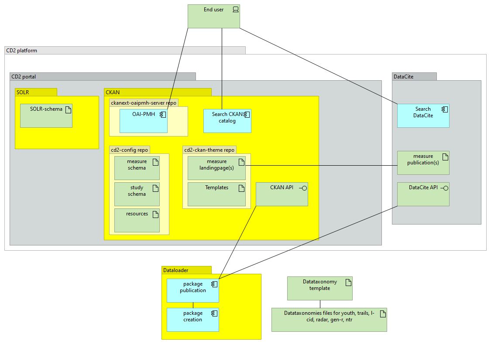

# CD2 platform

## Overview
The CD2 platform consists of a centralized metadata repository for six Dutch developmental cohort studies, collectively organized under the Consortium on Individual Development (CID).  

The CD2-platform provides access to metadata that covers various measures related to child development through:  

The CD2-catalog consists of  
-A **portal** serving as a **data catalog** allowing for (meta)data access based on the FAIR principle based upon CKAN-technology  
-Harvesting capabilities following the OAIPMH-standard

*Seeding the CD2-catalog*  
Initially after deployment the CD2-catalog is an empty shell.
In order to be able to present research metadata of the contributing cohort studies, the CD2 platform has to be seeded with relevant data first.  
This is dealt with using a standalone python application called **'dataloader'** (written by Otto Lange, Utrecht University).  
This python application compiles research data as forwarded by the contributing parties.

## Schematic overview of components and their relations within the CD2 platform
The overview gives a concise view of all kinds of elements and their relations.  
Even the github repo's.

### CD2-portal
The CD2-portal is based on CKAN-technoglogy that allows for extensive customization in the form of extension-modules .
In order to be able to serve the specific purpose as required by the consortium, CKAN is extended with following modules which have been developed by Utrecht University and are maintained in Github:  

1. https://github.com/UtrechtUniversity/cd2-ckan-theme  
Tailoring the frontend application of the catalog to the application's needs regarding style (css) and usability (javascript) as well as specific customization of ((by CKAN-provided) template files.

2. https://github.com/UtrechtUniversity/cd2-config  
Holds the specific **CKAN-schemas** and **SOLR schema** as required in order to manage and present the data.  
 Furthermore it holds resources like images that are required in templates or as logos.

3. https://github.com/UtrechtUniversity/ckanext-oaipmh-server  
Being a fully open system the CD2-system can be harvested using the AOIPMH-standard in datacite format.  
To be able to do so Utrecht University built a module that is added to the CKAN-framework as a CKAN extension derived from EUDAT-B2FIND/ckanext-oaipmh-server.

### Seeding of the CD2-catalog - Dataloader application
In order to provide data for the CD2-catalog, Utrecht University (Otto Lange) has developed a dataloader application.  
The 'loading process' consists of several (optional) steps which are performed using the so called  **'dataloader'**; a standalone Python application developed by Utrecht University (by Otto Lange).  

https://github.com/UtrechtUniversity/cd2-taxonomy

The functionality of the dataloader can be divided into two main parts:  
-Preparing data to be 'published' to the CD2 platform  
-Actual publication of cohort metadata to the CD2 platform including publication to DataCite.  
The catalog-page for each measure will serve as a landingpage for the corresponding DataCite-publication.

An essential part in this entire process is the taxonomy file

#### Taxonomy file(s)
Each taxonomy file is an excel file containing all details of a specific study.  
Each participating party of the consortium provides metadata concerning their corresponding studies within a taxonomy file.  
A **template** is in place so the participants can do so in a uniform manner.  
After (manual) verification and validation of the metadata the templates are 'frozen' (i.e. no more changes can be performed) into cohort specific **datataxonomy files**.  

The datataxonomy file is now ready to be used as input for the actual seeding (dataloading) of the CD2-catalog and / or DataCite.

#### Data preparation within the dataloader####  
The dataloader creates **package-JSON files** based upon each inidividual datataxonomy file.  
These **package-JSON files** serce as an intermediate or derived state to be used for (batchwise) loading (publishing) to CKAN and/or DataCite.  
Furthermore, each measure in a package file is given an identifier that will be used within the CKAN-portal as a means of uniquely identifying each dataset (i.e. measure).  

Two different JSON-files exist:  
-To seed the CKAN-portal with study/organization data:  
JSON-files that will hold details concerning the studies.   
-To seed the CKAN portal with measure (i.e. dataset) packages:  
JSON-files each containing all the details for a measure/dataset within the CD2 catalog

#### Data publication####  
Use the resulting JSON-files of the preparation process the dataloader publishes these to the CD2-platform and/or DataCite in a batchwise manner using the standard CKAN-API and DataCite-API.  

- publish packages to the CD2-CKAN-platform  
Per datapackage the dataloader determines a CKAN-identifier that is kept safe in the corresponding datataxonomy-file.

- publish to DataCite and retrieve a DOI per measure  
Each DataCite-publication, i.e. each measure, get its own uniquely identifying DOI.  
Each measure publication in DataCite is equipped with a landingpage-uri pointing to the corresponding CD2-platform-page based upon the CKAN-identifier.
Each measure in the CD2-portal is updated with the corresponding DOI.  
This way, both publications point to each other and the portal-publication serves as a **landingpage** for DataCite publication.

- Add the retrieved DOI from DataCite next to the CKAN-identifier in the datataxonomy file for persisting their unique relationship.

### The importance of datataxonomy files as a data repository ###
The importance of datataxonomy files lies not only in holding all individual study and measure details.  
The datataxonomy files contain two sorts of data:

- Study content-related i.e. metadata concerning the study-results themselves.  
- CD2-platform specific data with an actual functional purpose  
Each datataxonomy file holds the relationship between the CKAN-identifier and its corresponding DOI for each of its measures.  
DOI being the identifier of the measure-publication within DataCite.  
CKAN-identifier being the identifier of a measure within the CD2-platform.  
This relationship needs to be safeguarded at all times as it determines the link between two separate systems (CD2-catalog and DataCite).  
It thus assures **robustness/reproducibility** and ensures full recovery after system problems

## Deployment of the CD2-platform
Both CD2-catalog as well as the OAIPMH-server are deployed on one server.  
Deployment is performed following ITS-standards (Utrecht University) using Ansible.  
In essence it deploys all that is required for CKAN (including the platform specific extension models) as well as the OAIPMH-server.  

Follow the steps as mentioned in 'set up cd2-platform'

https://github.com/UtrechtUniversity/cd2-ansible

### General development and testing information
#### cd2-config repo ####
deployed in: **/usr/lib/ckan/cd2-config/ckanext/msl_ckan**

#### cd2-ckan-theme repo ####
deployed in: **/usr/lib/ckan/default/src/ckanext-cd2-theme**  
Notice that, due to lessc action by Ansible there are already changes present within the repo after deployment.

#### ckanext-oaipmh-server ####
deployed in: **/usr/lib/ckan/ckanext-oaipmh-server**

Some example OAIMPH requests:   
https://cd2.ckan.test/oai?verb=ListSets  
https://cd2.ckan.test/oai?verb=ListRecords&metadataPrefix=oai_datacite&set=youth  
https://cd2.ckan.test/oai?verb=ListRecords&metadataPrefix=oai_datacite  
https://cd2.ckan.test/oai?verb=ListMetadataFormats  

#### Mostly used log files ####

vi /var/log/ckan/ckan-uwsgi.stderr.log  
vi /var/log/nginx/error.log  
vi /var/solr/logs/solr.log

#### Restarting of servers ####
systemctl restart supervisord  
service nginx restart  
service solr restart  
supervisorctl restart ckan-uwsgi:*  

#### Schema locations ####
CKAN: **/usr/lib/ckan/cd2-config/ckanext/msl_ckan/schemas**  
SOLR: **/var/solr/data/ckan/conf/schema.xml**
